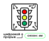

<p align="center">
    
</p>

# Система обнаружения нарушений ПДД

[](https://www.python.org/downloads/)
[](https://flask.palletsprojects.com/)
[](https://opencv.org/)
[](https://ultralytics.com/)
[](LICENSE)
[](https://socket.io/)
[](https://github.com/astral-sh/ruff)

Система для обнаружения нарушений ПДД на видеозаписях с использованием компьютерного зрения и технологий глубокого обучения. Проект включает веб-интерфейс для загрузки и обработки видео с обновлениями в реальном времени через `WebSocket` соединения.

## Особенности

Система предоставляет комплексное решение для автоматического анализа дорожного движения. Пользователи могут загружать видеофайлы через интуитивно понятный веб-интерфейс с поддержкой `drag & drop`. В процессе обработки система обеспечивает обновления статуса в реальном времени, позволяя отслеживать прогресс на каждом этапе.

Основная функциональность включает обнаружение различных типов нарушений ПДД:
- **Пересечение полосы движения** - автоматическое выявление случаев выезда за пределы полосы
- **Анализ дорожной разметки** - распознавание и анализ линий разметки
- **Преобразование перспективы** - создание вида сверху для более точного анализа

Система поддерживает параллельную обработку видео в фоновых потоках, что обеспечивает высокую производительность даже при работе с большими файлами.

Поддерживаются популярные форматы видео: `MP4`, `MOV` и `AVI`. Результаты представляются в виде визуализации с выделенными нарушениями, а пользователи могут просматривать изображения в полноэкранном режиме для детального анализа.

## Используемые технологии

### Backend

Серверная часть построена на `Python 3.x`, обеспечивая надежную основу для обработки данных. `Flask` служит веб-фреймворком для создания `API` и серверной логики, а `Flask-SocketIO` добавляет поддержку `WebSocket` для передачи обновлений в реальном времени.

Для компьютерного зрения и обработки видео используется `OpenCV`, который предоставляет мощные инструменты для анализа изображений. `YOLO` (You Only Look Once) обеспечивает быстрое и точное обнаружение объектов в кадрах видео. Дополнительно интегрирован `Tesseract` для распознавания текста, что позволяет анализировать дорожные знаки и разметку.

Многопоточная обработка реализована через `Threading`, что позволяет системе обрабатывать видео в фоновом режиме без блокировки пользовательского интерфейса.

### Frontend

Клиентская часть использует современный `JavaScript` (`ES6+`) для создания интерактивного пользовательского опыта. `Socket.IO Client` обеспечивает надежное `WebSocket` соединение для получения обновлений в реальном времени.

Интерфейс стилизован с помощью `TailwindCSS`, что обеспечивает современный и отзывчивый дизайн. `HTML5 Drag & Drop API` позволяет пользователям интуитивно загружать файлы перетаскиванием. Адаптивный дизайн гарантирует корректное отображение на всех устройствах, от мобильных телефонов до настольных компьютеров.

## Архитектура системы

### Общая архитектура

Система организована в модульную структуру, где каждый компонент отвечает за свою область функциональности. Веб-приложение содержит серверную логику, шаблоны интерфейса и клиентские скрипты, обеспечивая полный цикл обработки запросов пользователей.


Модуль детекции включает специализированные алгоритмы обработки видео и машинного обучения. Здесь реализованы сложные алгоритмы компьютерного зрения для анализа дорожной обстановки и выявления нарушений.

Временное хранилище обеспечивает безопасное хранение загруженных файлов с автоматической очисткой после обработки, что гарантирует эффективное использование ресурсов сервера.

### Поток данных

Обработка видео представляет собой многоэтапный процесс, оптимизированный для максимальной эффективности. Начинается все с загрузки файла пользователем через веб-интерфейс, после чего система автоматически валидирует формат и размер файла для обеспечения безопасности и производительности.


Создание уникального идентификатора задачи (`task_id`) позволяет системе отслеживать прогресс обработки и связывать результаты с конкретным пользователем. Фоновая обработка происходит в отдельном потоке, что обеспечивает отзывчивость интерфейса даже при работе с большими файлами.

`WebSocket` соединение обеспечивает мгновенную передачу обновлений о прогрессе обработки, создавая ощущение реального времени взаимодействия с системой. Финальным этапом становится отображение результатов в виде изображений с выделенными нарушениями.

### WebSocket интеграция

Технология `WebSocket` лежит в основе системы реального времени, обеспечивая мгновенную передачу обновлений между сервером и браузером. Это решение устраняет необходимость постоянного обновления страницы и создает плавный пользовательский опыт.


На серверной стороне `Flask-SocketIO` обеспечивает надежную и масштабируемую передачу данных, поддерживая множественные одновременные соединения. Клиентская часть использует `Socket.IO` для стабильного подключения и автоматического восстановления соединения при сбоях сети.

### Управление состоянием

Архитектура системы построена на принципах реактивного программирования, где интерфейс автоматически адаптируется к изменениям состояния приложения. Это создает отзывчивый и предсказуемый пользовательский опыт.

Центральный компонент `AppState` управляет всем жизненным циклом приложения. Он отслеживает выбранный файл, контролирует статус загрузки и обработки, управляет `WebSocket` соединением и автоматически обновляет интерфейс при любых изменениях состояния.

Компонент `UI` отвечает за взаимодействие с пользователем. Он инициализирует все элементы страницы, обрабатывает пользовательские действия, обновляет прогресс-бар и отображает результаты. Дополнительно он управляет `drag & drop` функциональностью, обеспечивая интуитивный способ загрузки файлов.

## Установка и запуск

### Предварительные требования

Для корректной работы системы требуется `Python` версии `3.8` или выше. Менеджер пакетов `uv` обеспечивает быструю и надежную установку зависимостей. `Tesseract OCR` необходим для распознавания текста в кадрах видео. Опционально можно установить `CUDA` для ускорения обработки на графических процессорах.

### Установка зависимостей

Клонирование репозитория и установка зависимостей выполняется стандартными командами. Система автоматически настроит все необходимые компоненты при первом запуске.

```bash
git clone https://github.com/MrPaganiniFeeD/Hackathon.-Russia-is-a-country-of-opportunity
cd Hackathon.-Russia-is-a-country-of-opportunity
uv sync
```

### Запуск сервера

Запуск системы может выполняться как автоматически через скрипт, так и вручную через командную строку. Оба способа обеспечивают одинаковую функциональность.

```bash
# Автоматический запуск
run_webserver.cmd

# Или вручную
uv run python main.py
```

## Использование веб-интерфейса

<p align="center">
    <kbd></kbd>
    <em>Веб-интерфейс на ноутбуке</em>
</p>

### Быстрый старт

Работа с системой начинается с запуска сервера и открытия веб-браузера по адресу `localhost:5000`. Интерфейс интуитивно понятен и не требует специального обучения.

Загрузка видео происходит через `drag & drop` или стандартный диалог выбора файлов. Система автоматически начинает обработку и показывает прогресс в реальном времени. По завершении пользователь получает доступ к результатам анализа с возможностью детального просмотра каждого обнаруженного нарушения.

### Этапы обработки

Процесс анализа видео проходит через пять основных этапов:

1. **Инициализация**
   - Подготовка системы к обработке
   - Проверка доступности ресурсов
   - Создание рабочих директорий

2. **Загрузка видео**
   - Сохранение файла на сервере
   - Валидация формата и размера
   - Создание резервной копии

3. **Анализ кадров**
   - Извлечение ключевых кадров
   - Предварительная обработка
   - Подготовка к детекции

4. **Детекция нарушений**
   - Применение алгоритмов машинного обучения
   - Анализ дорожной обстановки
   - Выявление потенциальных нарушений

5. **Формирование результатов**
   - Создание итоговых изображений
   - Выделение обнаруженных нарушений
   - Генерация отчета

### Особенности интерфейса

Пользовательский интерфейс разработан с учетом современных стандартов `UX/UI`. `Drag & drop` функциональность сопровождается визуальными эффектами, создающими приятный опыт взаимодействия. `Real-time` обновления через `WebSocket` обеспечивают мгновенную обратную связь.

Адаптивный дизайн гарантирует корректную работу на всех устройствах, от смартфонов до больших мониторов. Полноэкранный просмотр изображений позволяет детально изучить каждое нарушение, а плавные `CSS` анимации создают профессиональное впечатление.

<details>
<summary><strong>Показать варианты интерфейса на разных устройствах</strong></summary>

<p align="center">
  <kbd></kbd><br>
  <em>Веб-интерфейс на мобильном устройстве</em>
</p>

<p align="center">
  <kbd></kbd><br>
  <em>Веб-интерфейс на планшете</em>
</p>

<p align="center">
  <kbd></kbd><br>
  <em>Веб-интерфейс на ноутбуке или ПК</em>
</p>


</details>


## Технические детали

### Конфигурация

Система настраивается через конфигурационные файлы, где можно изменить порт сервера, ограничения на размер файлов и другие параметры. По умолчанию используется порт `5000`, максимальный размер файла ограничен `100 МБ`, а поддерживаемые форматы включают `MP4`, `MOV`, `AVI` и `WebM`.

Временное хранилище автоматически очищается после обработки, что обеспечивает эффективное использование дискового пространства и безопасность данных.

### Безопасность

Многоуровневая система безопасности включает валидацию файлов на клиенте и сервере, что предотвращает загрузку вредоносных файлов. Ограничения размера защищают от атак типа `DoS`, а санитизация имен файлов исключает проблемы с путями.

Временное хранение с автоматической очисткой минимизирует риски утечки данных, а изоляция процессов обработки обеспечивает стабильность системы.

### Производительность

Архитектура системы оптимизирована для высокой производительности. Многопоточная обработка позволяет системе обрабатывать несколько задач одновременно без блокировки интерфейса. `WebSocket` обеспечивает эффективную передачу данных с минимальными накладными расходами.

Кэширование `DOM` элементов ускоряет операции с интерфейсом, а `lazy loading` изображений снижает нагрузку на сеть и ускоряет загрузку результатов.

### Обработка ошибок

Система включает комплексную обработку ошибок на всех уровнях. Валидация файлов предотвращает большинство проблем на этапе загрузки. `Graceful degradation` обеспечивает работу системы даже при частичных сбоях сети.

Информативные сообщения об ошибках помогают пользователям понять и исправить проблемы, а автоматическое восстановление `WebSocket` соединения обеспечивает непрерывность работы.

## API Endpoints

### POST `/upload-video`

Основной `endpoint` для загрузки видеофайлов принимает `multipart/form-data` и возвращает `JSON` с идентификатором задачи и статусом операции. Это позволяет интегрировать систему с другими приложениями.

### WebSocket Events

Система поддерживает четыре основных типа `WebSocket` событий:

- **`join`** - Присоединение к комнате конкретной задачи
- **`progress_update`** - Передача информации о прогрессе обработки
- **`processing_complete`** - Сигнал о завершении работы
- **`processing_error`** - Уведомление об ошибках

## Разработка

### Структура кода

Архитектура кода следует принципам модульности и разделения ответственности. Модульная структура позволяет легко добавлять новые функции и поддерживать существующий код. Классовый подход в `JavaScript` обеспечивает чистую организацию и переиспользование компонентов.

`Event-driven` архитектура создает отзывчивую систему, где все действия основаны на событиях. `Separation of concerns` четко разделяет логику интерфейса и бизнес-логику, что упрощает тестирование и поддержку.

### Расширение функциональности

Система спроектирована для легкого расширения. Новые типы нарушений добавляются в модуль детекции, `WebSocket` события расширяются на сервере, `UI` компоненты обновляются в клиентской части, а валидации добавляются в систему управления состоянием.

## Хакатон

Проект разработан в рамках хакатона "Цифровой прорыв. Сезон: Искусственный интеллект (2024 год)".


## Лицензия

Лицензия [`MIT`](LICENSE).
